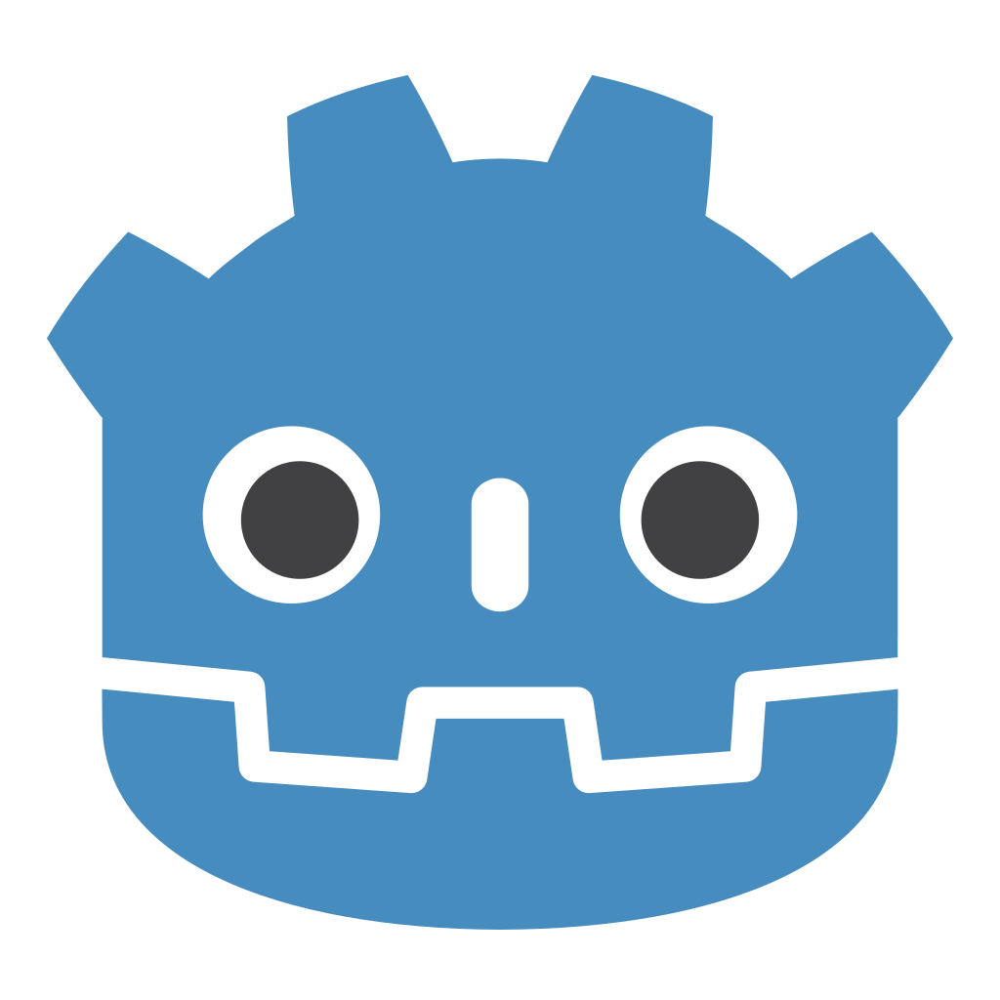

## Hi there 👋

I'm **AJ**! I am a **Software Engineer**!

- ❓ I'm a __very curious__ person
- 🦁 I'm competing in __VALORANT__ for **Golden Lions Esports**
- 🏀 I love **basketball**!

I have a plethra of programming languages that I have experience in.
<pre>
Here are the languages I am highly proficient in from left to right:  
                                                  
</pre>

<pre>
Here are other languages I have experience in but I don't have enough projects in to call myself "proficient" at:  
                                      
</pre>

I watch some anime, but you know Dragon Ball is the GOAT!  

